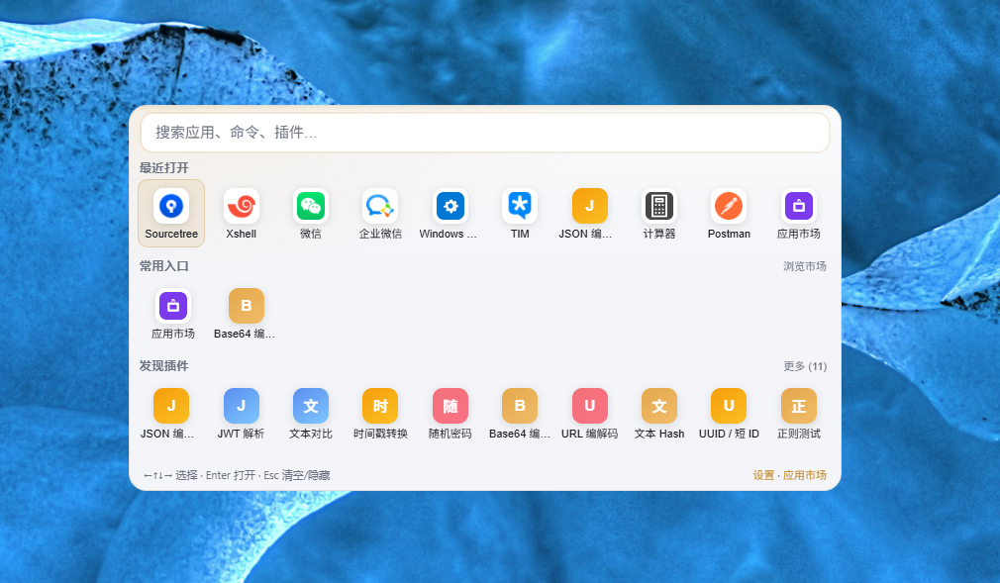
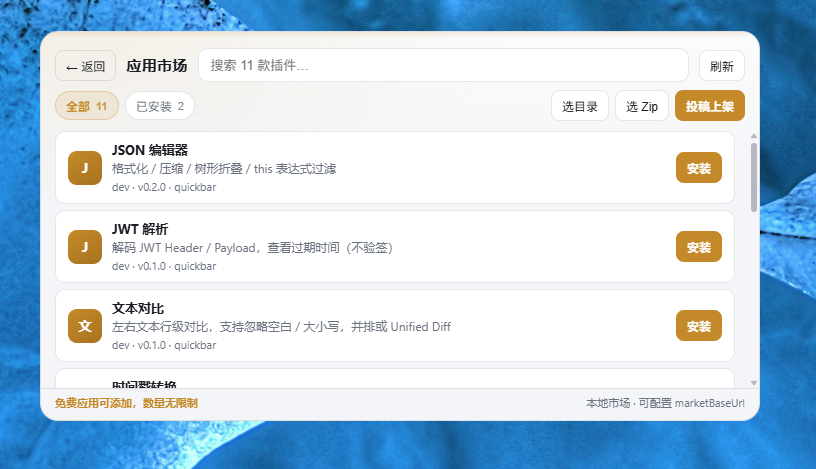
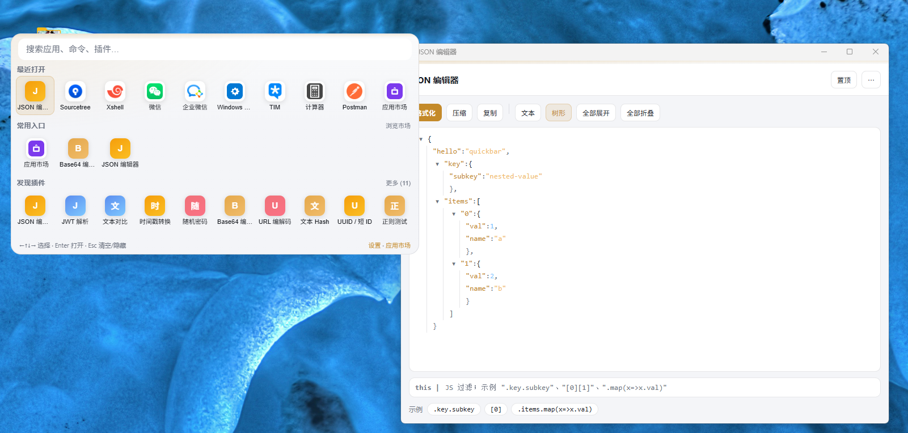

# Quickbar

本地桌面启动器：**无登录、数据落本机**。全局热键唤起命令面板，搜索并打开本机应用 / 运行命令，系统托盘常驻；内置应用市场，**免费应用可添加、数量无限制**。

视觉为独立的深色 + 琥珀强调色命令面板，不是白底磁贴启动器仿品。

### 界面预览

**首页**



**应用市场**（底栏：免费应用可添加，数量无限制）



**插件独立窗**



## 技术栈

- Tauri 2（Rust 宿主）
- React + Vite（JavaScript）
- 本地数据目录：`~/.quickbar/`

## 功能（MVP）

| 能力 | 说明 |
|------|------|
| 全局热键 | 默认 `Ctrl+Space`（可在设置或 `~/.quickbar/config.json` 修改 `hotkey`） |
| 搜索 | 聚合本机应用、用户命令、内建/已装插件 |
| 开应用 | Windows 扫描开始菜单 / 桌面 `.lnk`；Linux 扫描 `.desktop` |
| 本地启动 | 粘贴 `.exe` / `.lnk` 路径可加入常用入口 |
| 命令 | `config.json` 里的 `commands` |
| 托盘 | 显示 / 打开市场 / 退出；左键单击切换主窗 |
| 内建插件 | `apps` / `commands` / `market` 等 |
| 插件市场 | 读本地 `catalog.json`，安装到 `~/.quickbar/plugins`，无需账号 |
| 会话保留 | 打开插件后失焦隐藏，热键再唤起仍停在该插件（不回首页） |
| 主题 | 设置中可选深色 / 浅色 / 随系统（跟随 Windows 深浅色） |
| 分离窗口 | 插件页「分离窗口」或 `Ctrl+D`；独立窗可置顶 / 最小化 / 关闭 |

## 环境要求

官方对照：[Tauri 2 Prerequisites](https://v2.tauri.app/start/prerequisites/)。

> 全局热键与托盘需要 **Windows 原生进程**。  
> **不要**在 `Z:\` / `\\wsl.localhost\...` 上直接跑 Windows 的 `npm install`（会撞 Linux 符号链接，出现 `EISDIR` / `EPERM`）。  
> 请把项目拷到 Windows 盘再装依赖，例如 `C:\dev\quickbar`。

### Windows（推荐验收环境）

在 **PowerShell** 中安装（管理员权限更省事；装完后**新开一个终端**再验证）。

#### 1. Node.js 18+

```powershell
# 推荐 LTS
winget install --id OpenJS.NodeJS.LTS -e

# 验证（新开终端后）
node -v
npm -v
```

也可从 [nodejs.org](https://nodejs.org/) 下载安装包。

#### 2. Rust（MSVC 工具链）

Tauri 在 Windows 上需要 **MSVC** 版 Rust（不要选 GNU）。

```powershell
# 方式 A：winget 安装 rustup（推荐）
winget install --id Rustlang.Rustup -e

# 方式 B：PowerShell 下载官方安装器
Invoke-WebRequest -Uri "https://win.rustup.rs/x86_64" -OutFile "$env:TEMP\rustup-init.exe"
& "$env:TEMP\rustup-init.exe"
```

安装器里默认选 `1) Proceed with installation` 即可；默认 host 应为 `x86_64-pc-windows-msvc`（ARM 机器则为 `aarch64-pc-windows-msvc`）。

若已装过 Rust，强制切到 MSVC：

```powershell
rustup default stable-msvc
```

验证：

```powershell
rustc --version
cargo --version
```

#### 3. Microsoft C++ Build Tools（含 Windows SDK）

Rust / Tauri 编译需要 MSVC 链接器与 Windows SDK。

```powershell
# 方式 A：winget 安装 Visual Studio Build Tools 2022
winget install --id Microsoft.VisualStudio.2022.BuildTools -e --override "--wait --passive --add Microsoft.VisualStudio.Workload.VCTools --includeRecommended"
```

或手动下载 [Build Tools for Visual Studio](https://visualstudio.microsoft.com/visual-cpp-build-tools/)：

1. 打开安装器  
2. 勾选 **使用 C++ 的桌面开发**（Desktop development with C++）  
3. 右侧确认包含 **MSVC**、**Windows 10/11 SDK**

#### 4. WebView2

Win10（1803+）/ Win11 一般已自带。若缺失，下载 [Evergreen Bootstrapper](https://developer.microsoft.com/en-us/microsoft-edge/webview2/#download-section) 安装。

```powershell
# 可选：用 winget 安装运行时
winget install --id Microsoft.EdgeWebView2Runtime -e
```

#### 5. 安装后自检

新开 PowerShell：

```powershell
node -v
npm -v
rustc --version
cargo --version
where.exe link   # 应能找到 VS 的 link.exe（MSVC）
```

### Linux（可选）

见 [Tauri Linux 前置依赖](https://v2.tauri.app/start/prerequisites/#linux)。

```bash
# Rust
curl --proto '=https' --tlsv1.2 -sSf https://sh.rustup.rs | sh
source "$HOME/.cargo/env"

# Node（任选其一；示例为 NodeSource / 发行版自带亦可）
# 或：https://nodejs.org/

# Ubuntu / Debian 系统库
sudo apt update
sudo apt install libwebkit2gtk-4.1-dev libayatana-appindicator3-dev \
  librsvg2-dev patchelf libdbus-1-dev pkg-config build-essential
```

## 开发启动

在 **Windows 原生终端**（PowerShell / cmd）中：

```powershell
cd C:\dev\quickbar
npm install
npm run tauri:dev
```

首次启动后：

- 双击 exe 启动会弹出主界面（同时进托盘常驻）；之后可用热键/托盘再唤起
- 按 `Ctrl+Space` 唤起搜索面板（避免与 Windows `Alt+Space` 系统菜单冲突）
- Esc 或失焦隐藏；再次热键会保留当前页（插件/市场）
- 插件页可「分离窗口」：独立窗带系统标题栏，支持置顶

## 配置

`~/.quickbar/config.json` 示例：

```json
{
  "hotkey": "Ctrl+Space",
  "theme": "system",
  "marketCatalog": "market/catalog.json",
  "marketBaseUrl": "",
  "commands": []
}
```

`theme` 可选：`dark`（深色）、`light`（浅色）、`system`（随系统，默认）。也可在设置页切换。

## 插件约定

每个插件目录包含 `plugin.json`：

```json
{
  "id": "my-tool",
  "name": "我的工具",
  "version": "0.1.0",
  "author": "you",
  "description": "说明",
  "entrypoint": "index.js",
  "features": ["search", "action"],
  "commands": [{ "code": "my", "label": "我的工具" }],
  "market": { "category": "dev", "icon": "icon.png" }
}
```

- **内建**：仓库 `plugins/`
- **用户安装**：`~/.quickbar/plugins/<id>/`

第一版由宿主聚合搜索结果；`entrypoint` 预留给后续脚本扩展。

## 内部市场上架（无登录）

1. 在 `market/packages/<id>/` 放好插件（至少 `plugin.json`）
2. 在 `market/catalog.json` 增加条目，`source` 使用 `local:packages/<id>`
3. 用户侧也可直接改 `~/.quickbar/market/catalog.json`，并把包放到 `~/.quickbar/market/packages/`
4. 应用内「应用市场」→ 安装；或「安装目录 / 安装 Zip」

仓库内置示例插件：`json-format`（JSON 编辑器）、`jwt-parse`（JWT 解析）。

## 云端市场（投稿 + 审核）

独立服务仓库：[`~/dev/python/quickbar_market`](../quickbar_market)（或同盘路径）。

1. 启动市场服务（见该目录 README），默认 `http://127.0.0.1:8787`
2. 在本机 `~/.quickbar/config.json` 增加：

```json
{
  "marketBaseUrl": "http://127.0.0.1:8787"
}
```

3. Quickbar 市场页将拉取远程 catalog；安装时下载 zip 再解压到本机  
4. 「投稿上架」上传 zip → 服务端 `pending` → 管理员 `X-Admin-Token` 审核通过后进入 catalog  
5. 远程不可用时自动回退本地 catalog  

种子示例包：

```bash
cd ~/dev/python/quickbar_market
python scripts/seed_from_quickbar.py --token "$ADMIN_TOKEN"
```

## 发给别人：用安装包（推荐）

```bat
cd /d C:\dev\quickbar
npm run tauri:build
```

产物：`src-tauri\target\release\bundle\nsis\Quickbar_*_x64-setup.exe`  
把这个 setup 发给好友即可，插件/市场资源会随安装写入，不必再拷 `plugins` / `market` 文件夹。

本机自用也可：

| 方式 | 命令 / 路径 | 说明 |
|------|-------------|------|
| 开发态 | `npm run tauri:dev` | 改代码热更新 |
| 仅 exe | `npm run tauri:build:exe` | `src-tauri\target\release\quickbar.exe` |
| 便携夹 | `npm run tauri:portable` | `dist-portable\Quickbar\`（须整夹拷贝） |

数据目录均为 `%USERPROFILE%\.quickbar\`。

## 常用脚本

```bash
npm run dev              # 仅前端
npm run build            # 前端构建
npm run test             # 前端 Vitest
npm run test:rust        # Rust cargo test（建议在 Windows 上跑）
npm run test:all         # 前端 + Rust 自动化回归
npm run tauri:dev        # 桌面开发（免安装）
npm run tauri:build:exe  # 只编 exe，不打 setup
npm run tauri:portable   # 编 exe + 打便携夹 dist-portable/Quickbar
npm run pack:portable    # 已有 release exe 时只打包便携夹
npm run tauri:build      # 打 NSIS 安装包（可选）
```

## 测试与发版

发版或合并大改前：

```bat
cd /d C:\dev\quickbar
npm run test:all
```

1. **自动化**：Vitest（JSON 过滤、bootParams、最近使用 normalize、独立窗 label）+ `cargo test`（插件解析、搜索裁剪、市场路径、.desktop 解析）
2. **手工**：对照 [docs/regression-checklist.md](docs/regression-checklist.md)（热键、会话保留、分离多窗、置顶、市场）
3. 改功能时优先补/改对应单测；UI 行为更新清单条目

约定：`test:all` 通过后再打安装包；数据目录 `~/.quickbar` 一般不受覆盖安装影响。

## 目录结构

```
quickbar/
├── src/                 # React UI（含 src/utils/*.test.js）
├── src-tauri/           # Rust 宿主（模块内 #[cfg(test)]）
├── docs/                # 手工回归清单等
├── plugins/             # 内建插件
└── market/              # catalog + 可上架包
```

## 本阶段不做

- 账号 / 云同步 / 付费审核流
- 完整插件 WebView 沙箱
- 剪贴板历史、OCR、截图等（后续可按插件加）
- 应用内自动更新（规划中：Tauri updater + 签名安装包）
